<p align="center"></p>

<p align="center"><sub>10-second tour: Username → Variants → Scan → Stream → Profile → Export</sub></p>

<p align="center">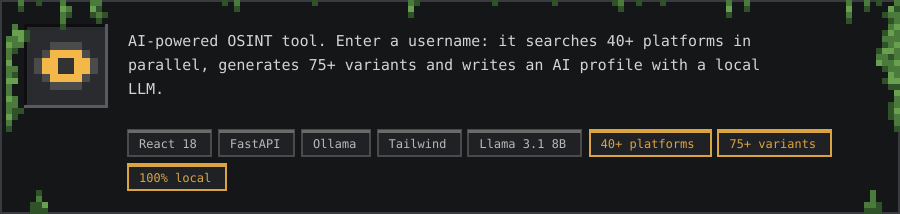</p>

<p align="center"></p>

<a id="features"></a>
<h2></h2>

<p align="center"></p>

<a id="requirements"></a>
<h2></h2>

<p align="center">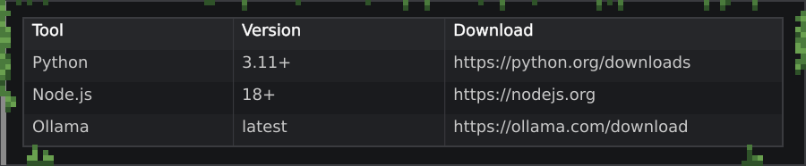</p>

<a id="quick-setup-windows"></a>
<h2></h2>

<p align="center">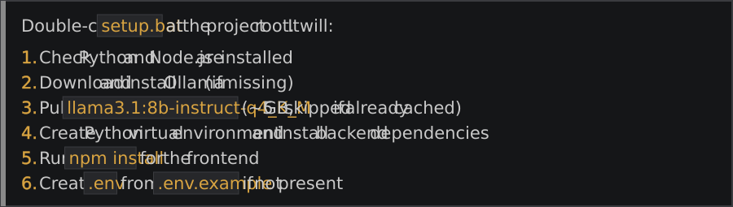</p>

<a id="manual-setup"></a>
<h2></h2>

<p align="center">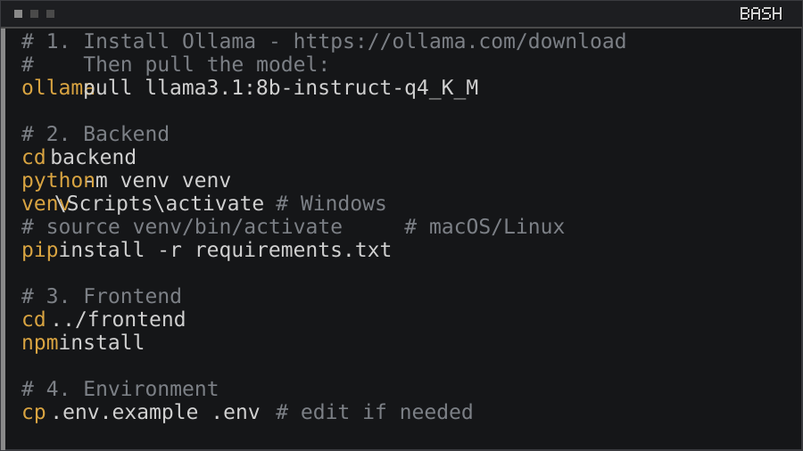</p>

<details>
<summary>Copy as text</summary>

```bash
# 1. Install Ollama — https://ollama.com/download
#    Then pull the model:
ollama pull llama3.1:8b-instruct-q4_K_M

# 2. Backend
cd backend
python -m venv venv
venv\Scripts\activate          # Windows
# source venv/bin/activate     # macOS/Linux
pip install -r requirements.txt

# 3. Frontend
cd ../frontend
npm install

# 4. Environment
cp .env.example .env           # edit if needed
```

</details>

<a id="running"></a>
<h2></h2>

<p align="center">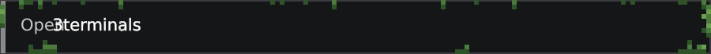</p>

<p align="center">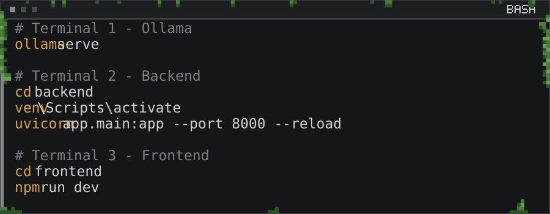</p>

<details>
<summary>Copy as text</summary>

```bash
# Terminal 1 — Ollama
ollama serve

# Terminal 2 — Backend
cd backend
venv\Scripts\activate
uvicorn app.main:app --port 8000 --reload

# Terminal 3 — Frontend
cd frontend
npm run dev
```

</details>

<p align="center">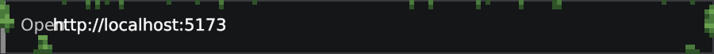</p>

<a id="environment-variables"></a>
<h2></h2>

<p align="center">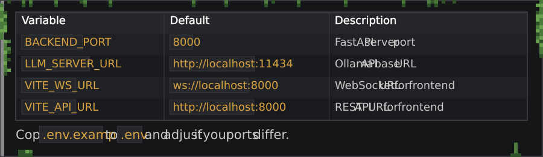</p>

<a id="how-it-works"></a>
<h2></h2>

<p align="center">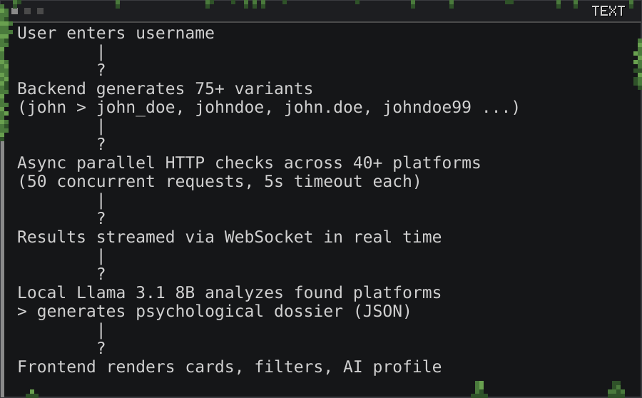</p>

<details>
<summary>Copy as text</summary>

```
User enters username
        │
        ▼
Backend generates 75+ variants
(john → john_doe, johndoe, john.doe, johndoe99 ...)
        │
        ▼
Async parallel HTTP checks across 40+ platforms
(50 concurrent requests, 5s timeout each)
        │
        ▼
Results streamed via WebSocket in real time
        │
        ▼
Local Llama 3.1 8B analyzes found platforms
→ generates psychological dossier (JSON)
        │
        ▼
Frontend renders cards, filters, AI profile
```

</details>

<a id="project-structure"></a>
<h2></h2>

<p align="center">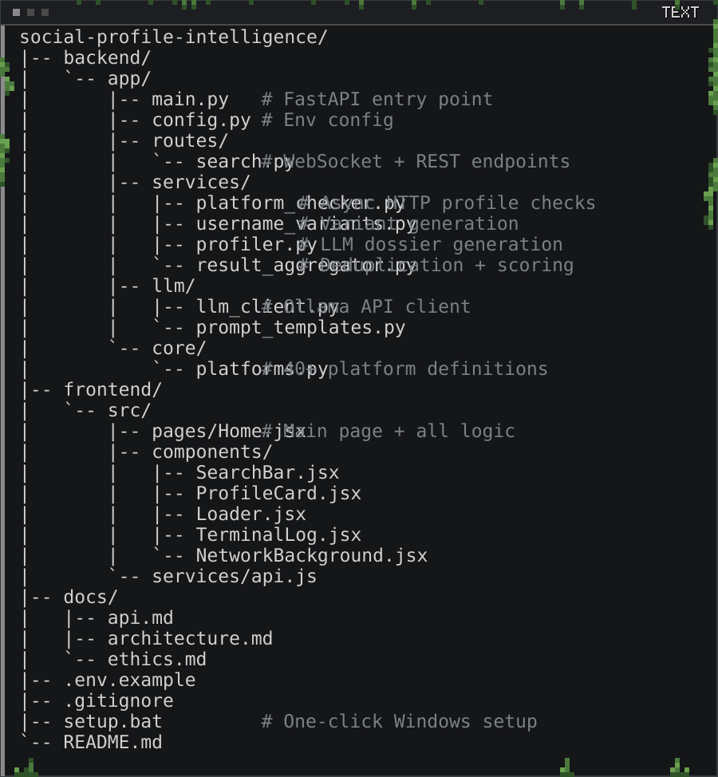</p>

<details>
<summary>Copy as text</summary>

```
social-profile-intelligence/
├── backend/
│   └── app/
│       ├── main.py              # FastAPI entry point
│       ├── config.py            # Env config
│       ├── routes/
│       │   └── search.py        # WebSocket + REST endpoints
│       ├── services/
│       │   ├── platform_checker.py   # Async HTTP profile checks
│       │   ├── username_variants.py  # Variant generation
│       │   ├── profiler.py           # LLM dossier generation
│       │   └── result_aggregator.py  # Deduplication + scoring
│       ├── llm/
│       │   ├── llm_client.py    # Ollama API client
│       │   └── prompt_templates.py
│       └── core/
│           └── platforms.py     # 40+ platform definitions
├── frontend/
│   └── src/
│       ├── pages/Home.jsx       # Main page + all logic
│       ├── components/
│       │   ├── SearchBar.jsx
│       │   ├── ProfileCard.jsx
│       │   ├── Loader.jsx
│       │   ├── TerminalLog.jsx
│       │   └── NetworkBackground.jsx
│       └── services/api.js
├── docs/
│   ├── api.md
│   ├── architecture.md
│   └── ethics.md
├── .env.example
├── .gitignore
├── setup.bat                    # One-click Windows setup
└── README.md
```

</details>

<a id="platform-categories"></a>
<h2></h2>

<p align="center">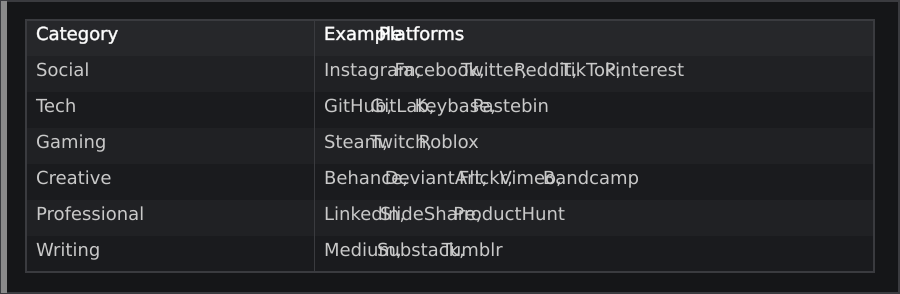</p>

<a id="ethics--legal"></a>
<h2></h2>

<p align="center">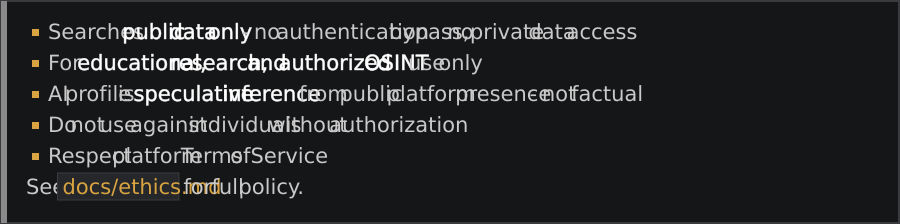</p>

<p align="center"><a href="docs/ethics.md">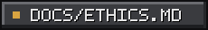</a></p>

<a id="tech-stack"></a>
<h2></h2>

<p align="center">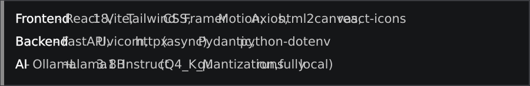</p>

<p align="center"><a href="https://github.com/thanmaiashok"></a></p>
